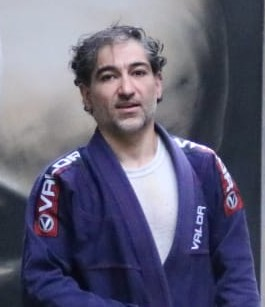

- 🧠 Hallo here is small trying to learn : HTML / CSS / JAVA-Script / BOOTSTARP / SASS / EXPRESS / REACT 👨🏼‍🎓

#  Let us start!
## Do not forget I am martial-art player before anything else!

- 👋 Hi, I’m Barry
- 👀 I’m interested in Sport
- 🌱 I’m currently learning WebDev
- 💞️ I’m looking to collaborate on HTML, CSS , Java scripts small projects
- 📫 How to reach me 01578444661 whatsup or mbrsyr@yahoo.com

 - Do you like sport :muscle: ?

By the way, Do you like **Hummus** [go to the recipe then](#nutrition) :point_down:

---
## Nutrition
A typical 100-gram serving of hummus will usually contain:
kcal | Fat | Protin | Carbohyd | Fiber | Magnesium | calcium | Iron | Sodium | B-6
|-|-|-|-|-|:-:|-|-|-|-|
214 | 10 g | 11 g | 29 g | 7 g | 17% | 70 mg | 13% | 600 mg |10%

:hourglass: Prep: 10 min
:fork_and_knife: cuts into 12 slices
:star: :star: :star: :star: :star: (95 ratings)

### Ingredients

* for 200 g plate
  - 150 g chickpeas
  - 40 g tahini
  - 1 glove garlic
  - one lemon juice
  - tea spoon ground cumin
  - olive oil

### Method

  1- puree all ingredients, except for the chickpeas, until they form a smooth paste. 
  2- Add the chickpeas, then puree the mixture until it is smooth.

  > *Recipe from medical news today, [july 2021](https://www.medicalnewstoday.com/articles/is-hummus-healthy)*

  ```
  {
    "First name" : "Mohamed" ,
    "Family name" : "AL-barry" ,
    "E-mail" : "mbrsyr@yahoo.com"
  }
  ```


